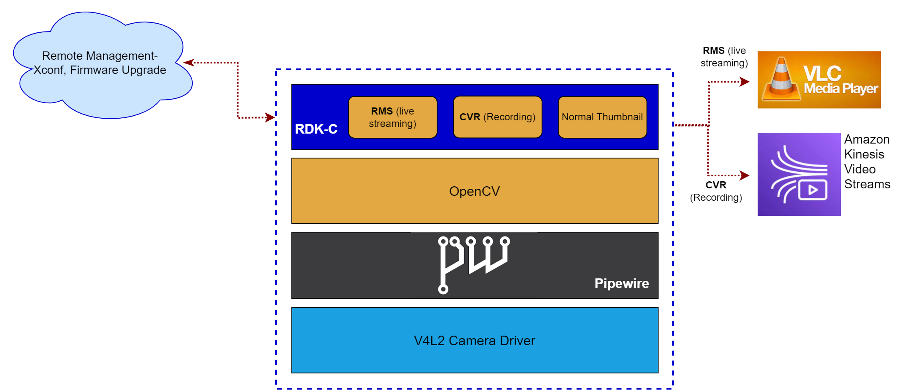

# RDK Camera Documentation

## What is RDK Camera(RDK-C)?

RDK-C provides a common set of software components to build IP-based video cameras with standard functions, such as live streaming and continuous recording. RDK accelerates the deployment of next-gen IP camera products and services while simplifying the customization of the application and user experience.

------------------------------------------------------------------------

## Key Features

-   Configuration management : config is fetched from cloud via polling which is triggered in regular interval(can also be forced) , once the config is fetched it is parsed and saved for respective feature
-   Resolution : Supported resolutions - 480p,720p, and 1080p
-   Bit rate : 115200
-   Recording settings : 24/7 live recording with 720p resolution
-   Wi-Fi : supports 2.4GHZ and 5GHZ
-   Live video : 24/7 supported with 2way audio options enabled
-   Thumbnail : SmartThumbnail - Getting YUV frames and convert that into JPEG image for the thumbnail based on the motion detection from video analytic engine
-   24/7 video recording : CVR module which use amazon kinesis video to handle this feature
-   Firmware upgrade, RDK feature control, and Log upload through XCONF Server

------------------------------------------------------------------------

## Overall Service Offerings

Below illustration depicts the service offerings by RDK Camera :

Let us understand the components present in above diagram:

### RDK Media Streamer(RMS)

RMS (RDK Media Streamer) is a versatile media server designed to deliver a wide range of live and on-demand content to various screens. It acts as a multi-format, multi-protocol server that can distribute media-rich content across different platforms and screens. With the capability to ingest a live H.264 video stream from various encoders like MPEG-TS, RTMP, or RTP, RMS can transform and broadcast the stream simultaneously to different endpoints such as PCs, Macs, mobile phones, tablets, and TVs. It utilizes WebRTC/RTSP streaming protocol for seamless end-to-end streaming.

### Mediastreamer

Mediastreamer facilitates the streaming of captured media content from a camera by utilizing HTTP streaming via the Mongoose server. It leverages the gstreamer media framework to stream H264 encoded content to the Mongoose server. The resulting output from the media streamer can be directed as input to RDK Mediastreamer (RMS) or the Continuous Video Recording (CVR) modules for further processing or recording.

### **CVR(Continuous Video Recording)​**

Continuous Video Recording feature to handle 24/7 live video recording on a resolution of 720p.
CVR functionality is enabled through the utilization of Kinesis Video Streams Producer libraries. These libraries allow for seamless installation and configuration on devices, providing a user-friendly solution for securely connecting and effectively streaming video content in various modes, such as real-time streaming, buffered streaming with a slight delay, or uploading media retrospectively.

### Pipewire

PipeWire offers the capability for multiple applications to access video data through it, functioning as an audio and video server. In PipeWire, applications and devices are depicted as nodes, each equipped with input and output ports to facilitate media sharing among nodes. Additionally, a session manager is provided to configure nodes, ports, and establish connections between different nodes, enhancing the overall management of the audio and video streaming process.

### KVS SDK

The KVS SDK comprises the Amazon Kinesis Video Streams(KVS) Producer libraries, which are user-friendly components integrated within the Kinesis Video Streams Producer SDK. These libraries are utilized by clients to develop on-device applications that securely connect to Kinesis Video Streams, enabling the real-time streaming of video and other media data for instant viewing through console or client applications. Media data can be streamed in real time, with a slight delay after buffering, or uploaded retrospectively as after-the-fact media uploads. Upon establishing a Kinesis Video Streams, data can be transmitted to the stream using the SDK to create custom application code that extracts video data from the source and uploads it to Kinesis Video Streams, referred to as producer applications.
Kinesis Video Stream SDK is opensourced from Amazon AWS .
CVR module uses KVS stack for 24/7 live recording as its prepare a clip and send it to the AWS Cloud.
In UserSpace, from application they can see the video clips recorded with the thumbnails. When user clicks it, it fetches from the AWS Cloud and provide that clip.

### Thumbnail

The RDK-C Thumbnail feature offers real-time thumbnails and generates thumbnails based on motion events. It includes two types of thumbnails: Next-Gen Thumbnail and Smart Thumbnail.
Thumbnail module is responsible for uploading the thumbnails with timestamp created from video analytics using Camera Feed Data.

### rtmessage

The rtmessage tool offers basic messaging functionalities over Unix domain or TCP sockets, providing support for remote procedure calls (RPC) and event capabilities.

### HttpClients

It is a curl based library for creating to handle HTTP protocol.
The HttpClients module in RDK-C offers APIs specifically designed for performing REST operations, enhancing the capability for seamless interaction with RESTful services.

### ConfigMgr

ConfigMgr streamlines the process of handling device settings and user-related management tasks i.e. managing the configurations requested from the cloud(CVR, live video, KVS, Thumbnail, Smart Thumbnail)

------------------------------------------------------------------------

## Additional Resources

**User Guides**

-   Architecture:
     
    For RDK-C architecture details and structuring of RDK-C Components, follow
     
    [Architecture](../rdk-camera-documentation/rdk-camera-architecture/rdk-camera-architecture.md)

